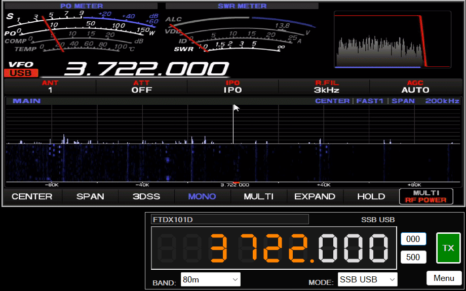

A C# simple example of controlling an amateur radio.
Requires Omnirig software to work

The program consists of two modules
<h2> CAMERA </h2>

This is a radio screen preview module.
If the radio has a monitor output, it can be connected via a special grabber module. Then the image from the radio is seen as a camera and can be displayed in a computer window.
The right mouse button opens the menu.

<h2> Omnirig CAT </h2>

An example of a simple radio control program. Requires omnirig to be installed. It allows you to change the frequency, mode, and the ability to transmit.
link to dxAtlas omnirig: https://www.dxatlas.com/omnirig/

- Automatic NTP clock synchronize
- Program can work with frequency offset (ex.for sattelite transmisions)
- Added TRX custom commands controll based on Yaesu manuals.
- Added POTA/SOTA/WWFF/DXCluster program window. You can use frequencies directly from POTA etc. spots and activations(by double click on grid row). Callsign is copied to clipboard.
- Added "doppler module" this is an experimental module that changes frequency over time (ex.for sattelite transmisions). I'm not sure if this is a sensible solution.

I am providing these modules with source code in C# enyoy.

Tomasz Fronczek SP4THK
